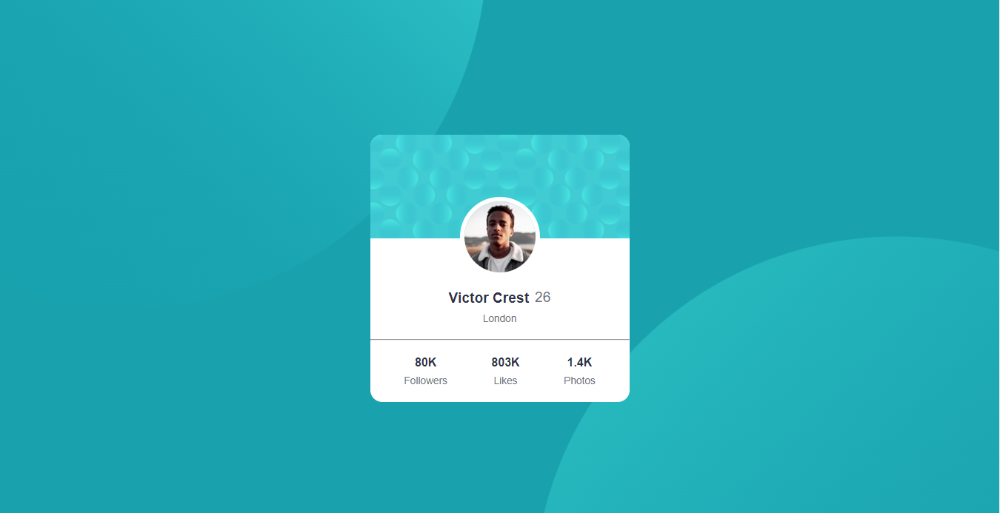

# Frontend Mentor - Profile card component solution

This is a solution to the [Profile card component challenge on Frontend Mentor](https://www.frontendmentor.io/challenges/profile-card-component-cfArpWshJ). Frontend Mentor challenges help you improve your coding skills by building realistic projects. 

## Table of contents

- [Overview](#overview)
  - [The challenge](#the-challenge)
  - [Screenshot](#screenshot)
  - [Links](#links)
- [My process](#my-process)
  - [Built with](#built-with)
  - [What I learned](#what-i-learned)
- [Author](#author)

## Overview

### The challenge

- Build out the project to the designs provided

### Screenshot


 -Desktop version



### Links

- Solution URL: (https://www.frontendmentor.io/solutions/profile-card-component-QV5Q5q8Uo-)
- Live Site URL: (https://grand-cactus-279104.netlify.app/)

## My process

### Built with

- Semantic HTML5 markup
- CSS custom properties
- Flexbox
- CSS Grid
- Mobile-first workflow

### What I learned

```css
body {
    background-image: url(images/bg-pattern-top.svg), url(images/bg-pattern-bottom.svg);
    background-position: -20rem -35rem, 45rem 20rem;
}

.profile__header {
    position: relative;
    margin-bottom: 3rem;
}

.person__img {
    position: absolute;
    top: 60%;
    left: 50%;
    transform: translate(-50%, -0%);
}

```

## Author

- Frontend Mentor - [@Aboubakr06](https://www.frontendmentor.io/profile/Aboubakr06)
- Twitter - [@elbouzidi99](https://twitter.com/elbouzidi99)

